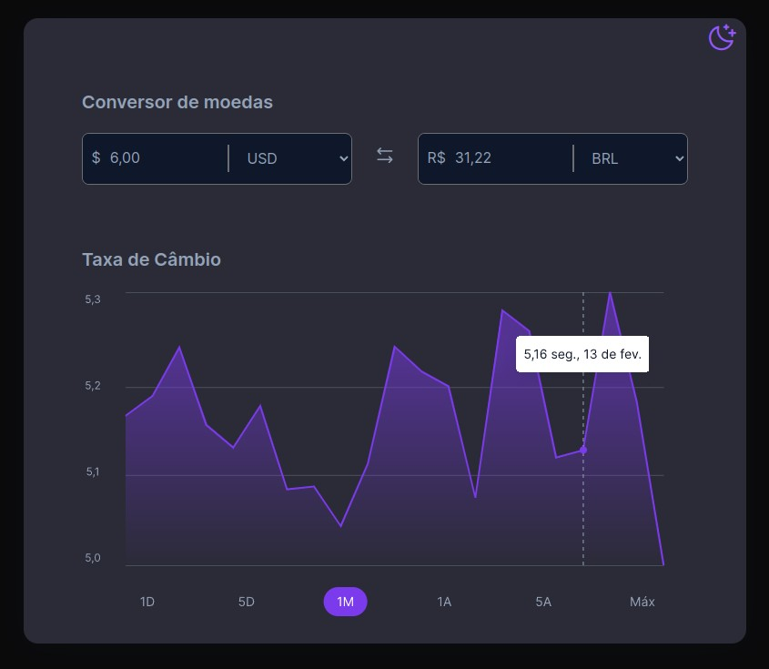

<h1 align="center"> CURRENCY COVERTER</h1>

   currency converter challenge 9 #BoraCodar.

  <a href="#-tecnologias">Technologies</a>&nbsp;&nbsp;&nbsp;|&nbsp;&nbsp;&nbsp;
  <a href="#-projeto">Project</a>&nbsp;&nbsp;&nbsp;|&nbsp;&nbsp;&nbsp;
  <a href="#-layout">Layout</a>&nbsp;&nbsp;&nbsp;|&nbsp;&nbsp;&nbsp;
  <a href="#memo-licença">License</a>

  

   <a href="https://charles-mrt.github.io/currency-converter/">TO ACESS THIS APP   CLICK HIRE</a>

 

  

## 🚀 Technologies

This project was developed with the following technologies:

- HTML e CSS - JavaScript 
- Using Exchange Rate API from https://www.exchangerate-api.com/

## 💻 Project

Currency Converter is a app that converts currency values where you can add the desired value and select the currency type.

## 🔖 Layout

To test the project you can access through  [THIS LINK](https://charles-mrt.github.io/currency-converter/)
<!-- To test the project you can access through you can view the project layout through [DESSE LINK](). É necessário ter conta no [Figma](https://figma.com) para acessá-lo. -->

## :memo: Licença

This project is under the MIT license.

---

Made with ♥ by Charles
